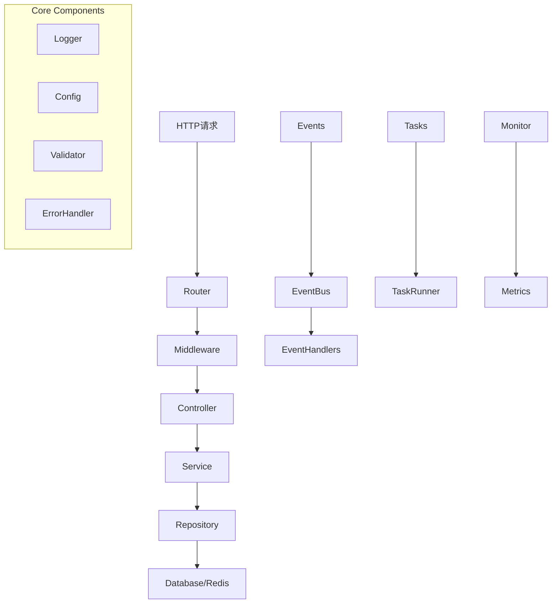

# GoWK Web Framework

GoWK是一个基于Go语言的企业级Web应用框架，提供了完整的项目结构和丰富的功能组件。

## 特性

- 🚀 基于Gin的高性能Web框架
- 🔐 内置认证和权限控制
- 📊 系统监控和指标收集
- 🎯 事件驱动架构
- 💾 数据库和Redis支持
- ⚡️ 任务系统
- 🔍 结构化日志
- ✨ 优雅的错误处理

## 项目结构

```
.
├── main.go                 # 应用入口
├── go.mod                 # Go模块定义
├── go.sum                 # 依赖版本锁定
├── internal/              # 内部包
│   ├── app/              # 核心应用组件
│   │   ├── errors/       # 错误处理系统
│   │   ├── config.go     # 配置管理
│   │   ├── database.go   # 数据库初始化
│   │   ├── redis.go      # Redis初始化
│   │   ├── logger.go     # 日志管理
│   │   ├── services.go   # 服务注册
│   │   └── validator.go  # 请求验证
│   ├── context/          # 请求上下文
│   │   ├── api_context.go    # API上下文封装
│   │   └── request_id.go     # 请求ID管理
│   ├── controllers/      # API控制器
│   │   ├── monitor_controller.go  # 监控接口
│   │   ├── product_controller.go  # 产品接口
│   │   └── user_controller.go     # 用户接口
│   ├── dto/             # 数据传输对象
│   │   ├── product_dto.go    # 产品相关DTO
│   │   ├── response_dto.go   # 通用响应DTO
│   │   └── user_dto.go       # 用户相关DTO
│   ├── events/          # 事件系统
│   │   ├── event_bus.go      # 事件总线
│   │   └── events.go         # 事件定义
│   ├── middleware/      # HTTP中间件
│   │   ├── auth.go           # 认证中间件
│   │   ├── events_middleware.go  # 事件中间件
│   │   ├── logger.go         # 日志中间件
│   │   └── response_formatter.go # 响应格式化
│   ├── models/          # 数据模型
│   │   ├── product.go        # 产品模型
│   │   └── user.go           # 用户模型
│   ├── repositories/    # 数据访问层
│   │   ├── product_repository.go
│   │   └── user_repository.go
│   ├── router/         # 路由管理
│   │   └── router.go         # 路由注册
│   ├── services/       # 业务逻辑层
│   │   ├── monitor_service.go
│   │   ├── product_service.go
│   │   └── user_service.go
│   └── tasks/          # 后台任务
│       └── tasks.go          # 任务定义
├── logs/               # 日志文件
└── utils/             # 通用工具
    ├── array.go
    ├── convert.go
    ├── file.go
    ├── http.go
    ├── paginator.go
    ├── security.go
    ├── stringutil.go
    └── timeutil.go
```

## 架构设计



## 快速开始

1. 克隆项目模板：

```bash
git clone https://github.com/yourusername/gowk-template.git myproject
cd myproject
```

2. 修改go.mod：

```bash
go mod edit -module github.com/yourusername/myproject
```

3. 安装依赖：

```bash
go mod tidy
```

4. 运行项目：

```bash
go run main.go
```

## 主要组件说明

### 错误处理

使用类型安全的错误码系统：

```go
// 返回错误响应
apiCtx.ErrorWithCode(errors.BadRequest, "Invalid parameters")

// 使用预定义错误
apiCtx.ErrorWithCode(errors.NotFound, "User not found")
```

### 事件系统

发布和订阅事件：

```go
// 发布事件
events.Publish(events.UserCreated, map[string]interface{}{
    "user_id": user.ID,
})

// 订阅事件
events.Subscribe(events.UserCreated, func(data map[string]interface{}) {
    // 处理事件
})
```

### 中间件

添加自定义中间件：

```go
// 路由组添加中间件
api := router.Group("/api")
api.Use(
    middleware.Auth(),
    middleware.Logger(),
)
```

### 监控

获取系统指标：

```go
stats := monitorService.GetStats()
fmt.Printf("Total Requests: %v\n", stats["total_requests"])
fmt.Printf("Error Rate: %.2f%%\n", stats["error_rate"])
```

## 配置说明

项目配置位于`config.yaml`：

```yaml
server:
  port: 8080
  mode: development

database:
  host: localhost
  port: 5432
  name: myapp
  user: postgres
  password: secret

redis:
  host: localhost
  port: 6379
  db: 0

log:
  level: info
  file: logs/app.log
```

## 许可证

MIT License
