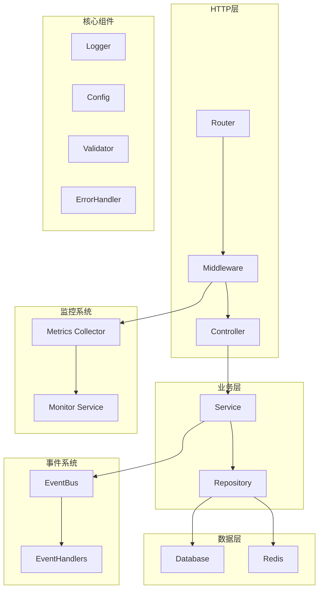
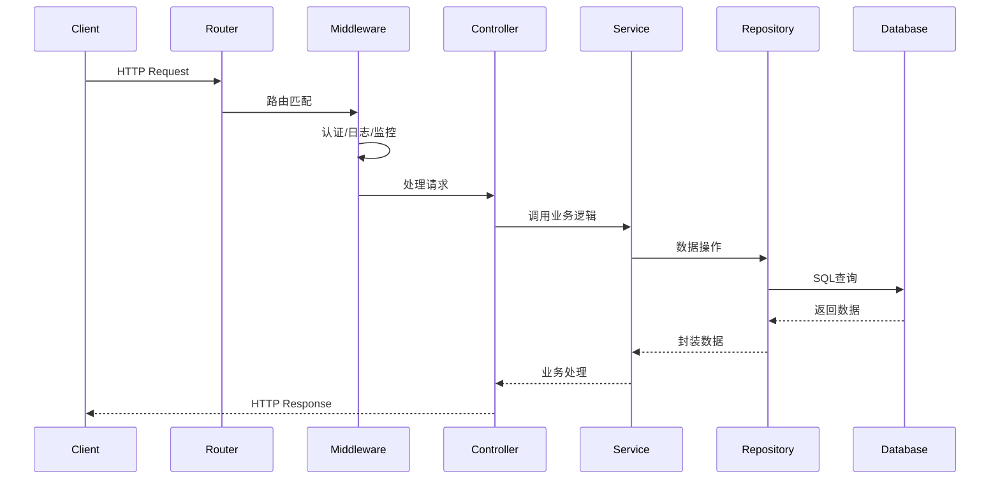
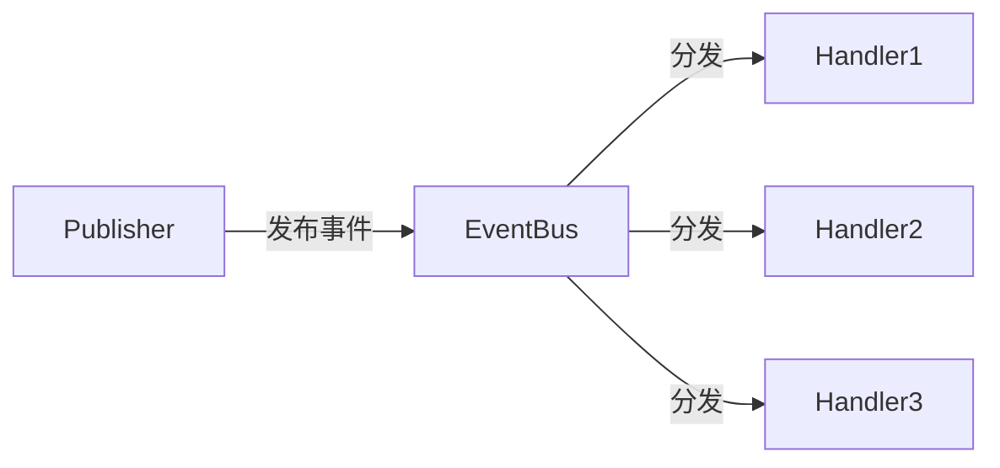
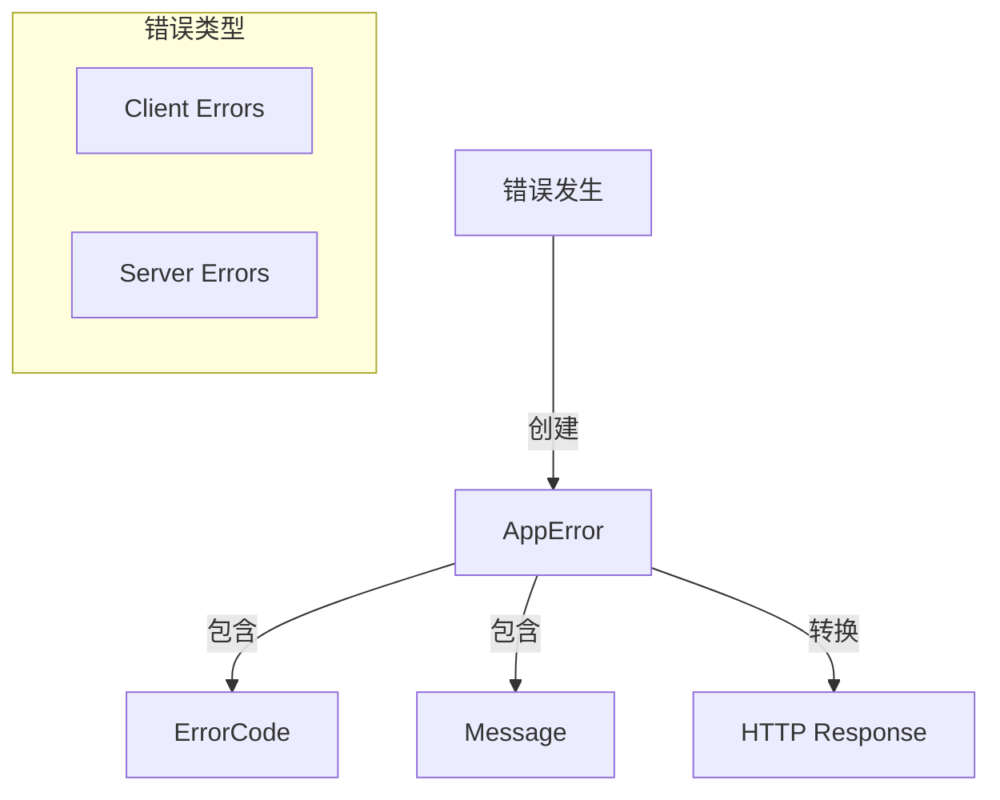
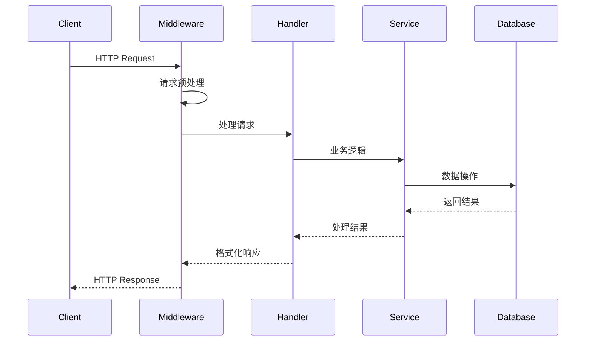
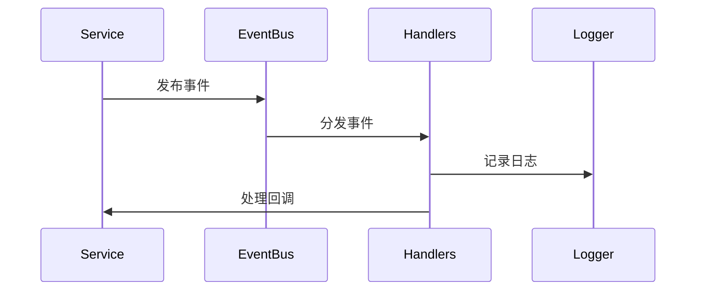
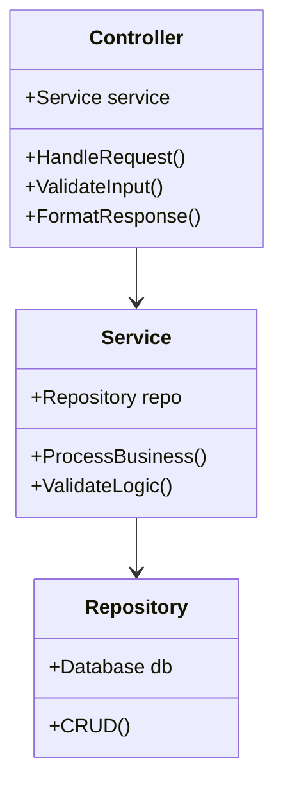
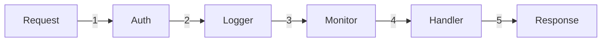
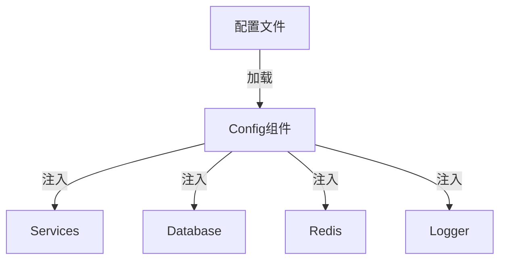
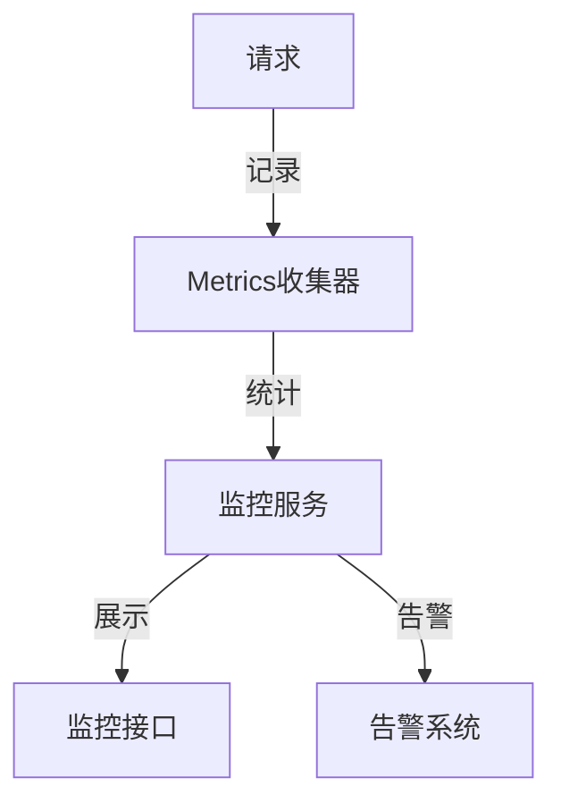

# GoWK 架构设计文档

## 整体架构

GoWK采用分层架构设计，主要分为以下几层：



## 核心组件

### 1. HTTP处理流程



### 2. 事件系统



### 3. 错误处理



## 数据流

### 1. 请求处理流程



### 2. 事件处理流程



## 组件交互

### 1. 控制器与服务层



### 2. 中间件链



## 配置管理



## 监控系统



## 安全架构

```mermaid
graph TD
    A[请求] -->|1| B[TLS终止]
    B -->|2| C[认证中间件]
    C -->|3| D[授权检查]
    D -->|4| E[输入验证]
    E -->|5| F[业务处理]
    F -->|6| G[响应加密]
